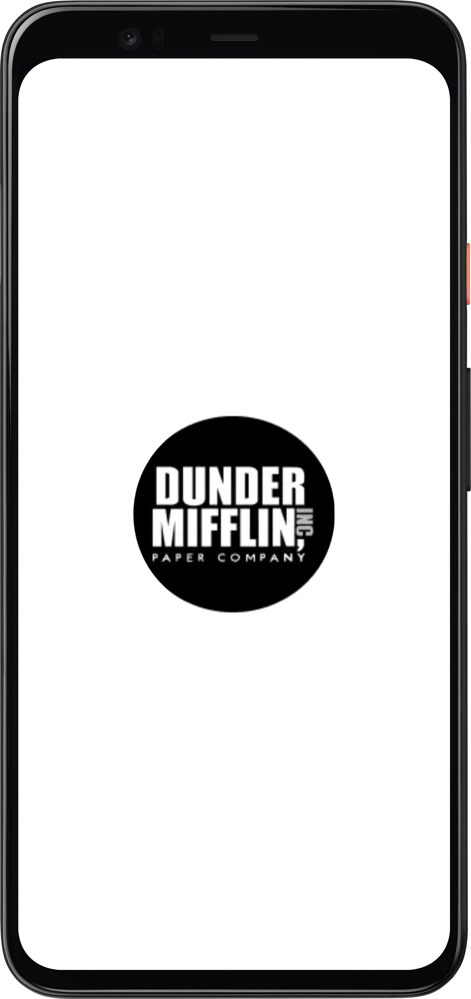
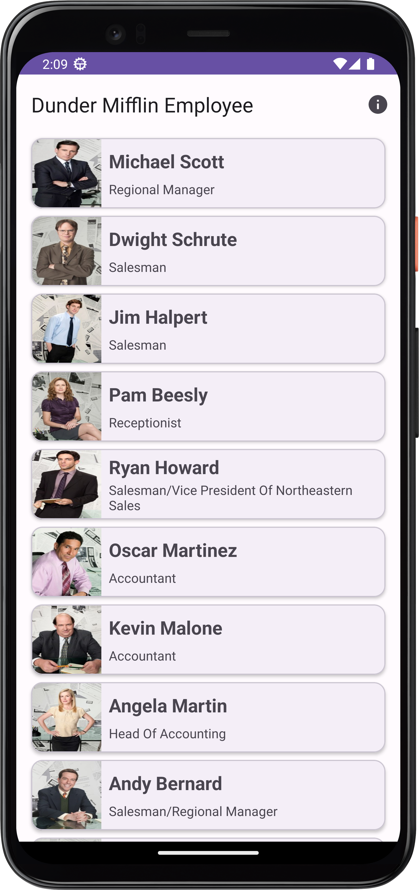
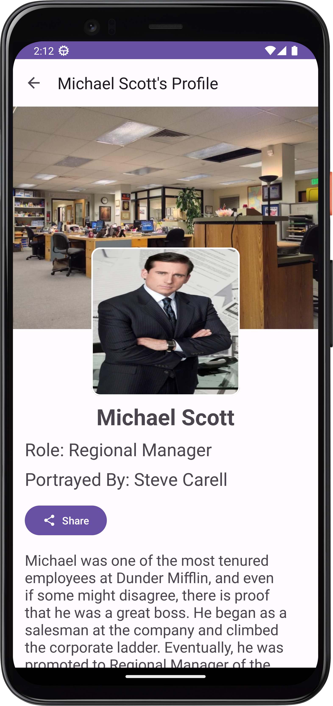
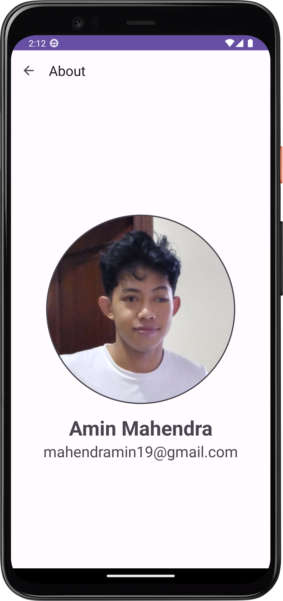

# Dunder-Mifflin-Employee
Submission of "Belajar Membuat Aplikasi Android untuk Pemula" course from Dicoding

## Description
A project built for completing one of Dicoding course, Belajar Membuat Aplikasi Android untuk Pemula.
This project is applying the material that taught in this course, like basic of android activity, intent, using several View and ViewGroup, theming, and using RecyclerView to display list type of data.

## How to run the app
Clone or download this repository and open it with Android Studio

## Features
<b>Splash Screen</b>
 

 
<b>Home</b>
 

 
<b>Detail</b>
 

 
<b>About</b>
 

 
